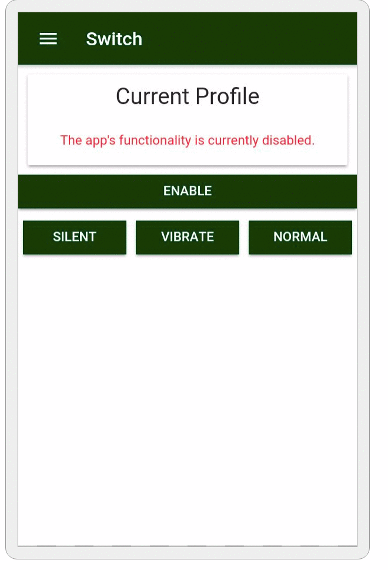
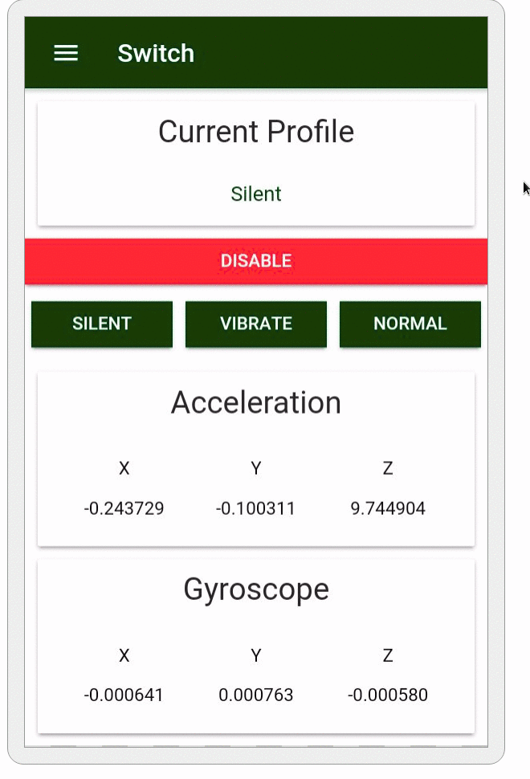
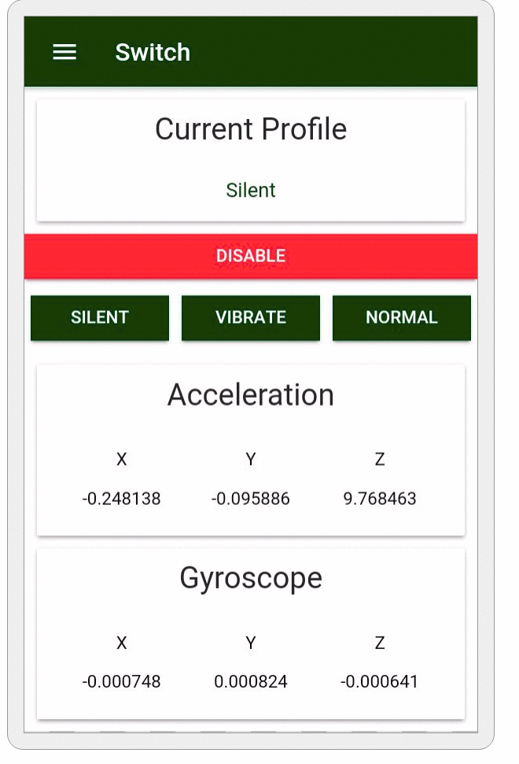
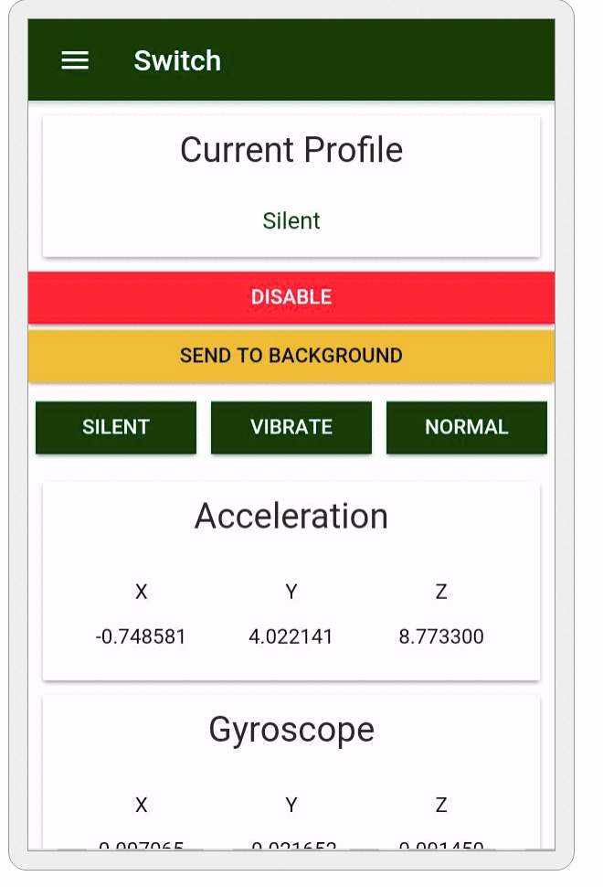
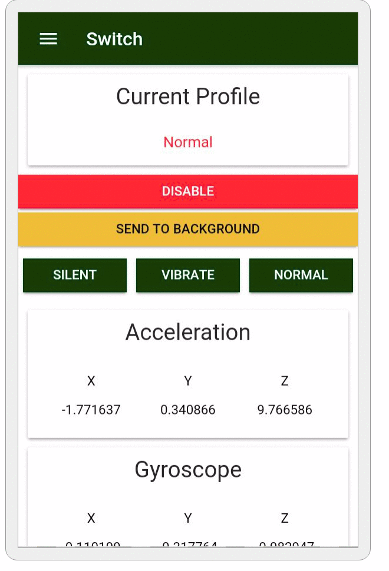

## Switch!

The project is trying to solve an issue that I am struggling with (and perhaps others are, too): being too lazy to switch the phone's profile from sound/vibration (when outside) to silent (when at work or sleeping). 

This will be a test for using Ionic (along with Angular) for developing an application for the Android (<s>maybe it works on iOS as well</s> not a chance with their restrictions) platform. The application will use the device motion sensors (such as accelerometer or gyroscope), along with some user defined settings (work/home locations, estimated hours when they are outside, estimated hours of sleep and perhaps even geolocation) to decide if the profile should be switched. The default action will be switching from vibration profile to silent profile, but these two might be able to be customized by the user.

In order to access the functionality for switching the profile to `Silent`, `Vibration` or `Normal` I had to write a `Cordova` plugin to wrap around the `Android` exposed `setRingerMode` and `getRingerMode` methods. The plugin can be found [here](https://github.com/NoMercy235/cordova-plugin-ringermode).

The algorithm that decides what state should the ringer be in can be found [here](https://github.com/SpamExperts/HackWeek/blob/master/2017/Alexandru/src/app/shared/motion-change-logic.service.ts). The comments and console.log statements are there for debugging purposes and they should be left alone if the app is not going into production since they provide useful information about what is happening with the device.  

Task list:
 - [x] Allow the app to run in background (with user's permission)
 - [x] Detect motion changes and switch the ringer in the mode that fits.
 - [x] Take into account user's preferences (scan frequency and motion sensibility)
 - [ ] Allow the user to select which modes to be switched. Right now, the change is only silent <-> normal.
 - [ ] Allow users to pick periods of time where they want a certain profile to be active instead of leaving the app to decide.
 - [ ] Allow the users to define locations such as work/home and take this into consideration when figuring out if the ringer should be switched.
 
Nice to have things:

 - [ ] Implement motion tracking using GPS, not just phone's sensors.
 - [ ] Write another Cordova plugin that allows the developer to turn off the phone.

## Use cases

 - Enable the application's functionality



This is all that it's required for Switch to do its job. You can lock the screen and see about your business while your phone will change profile according to your actions.

 - Customize for better user experience 



You can also fiddle a little with some parameters used in the algorithm to make it fit better to your needs. Be careful though, with high responsiveness comes high power usage.
Run in the background toggle allows Switch to run in the background instead of having to keep the application opened.

 - Stop switch
 

 
You can either press the disable button, or one of the `Silent`, `Virate` or `Normal` buttons to stop Switch and immediately change to the designated profile. 

 - Example of profile change
 
From silent to normal:



Keep in mind that the phone has been moving, but stopped for some time (normally it takes a bit longer to switch back to silent. It also depends on the user's customization settings).

From normal to silent:



The phone has been moving chaotically for some time. The change does not take place so fast, due to the silent protection, explained below.

Silent protection:


In this case, the phone has been sitting for a while and suffers a sudden movement. Notice that there is no change in the profile state, because that might have been the user moving the phone a little or taking it in their hand.

### Deployment steps: 

 - Run locally: 
```bash
$ cd /project/path
$ npm install
$ ionic cordova prepare // If you want to deploy on the phone
$ ionic serve
```
<b>Warning! Due to extensive usages of native capabilities (such as gyroscope or accelerometer) this project can hardly be run in the browser (it can, with many workarounds, but it would be useless).</b>

 - To add the Android platform:

```bash
$ ionic cordova platform add android
$ ionic cordova run android
```

Add the `--livereload` flag for live reloading.

 - To generate the resource files run:

```bash
ionic cordova resources android
ionic cordova resources android --splash
```

 - To generate the .apk file run:

```bash
$ ionic cordova build android
```
Add  `--release `  flag for the release version.


